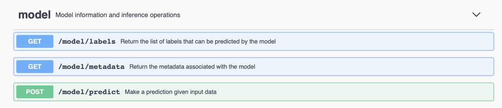

# Deploy a MAX model-serving microservice on Azure Kubernetes Service

This tutorial describes how to deploy deep learning model-serving microservices from the [Model Asset Exchange](https://developer.ibm.com/exchanges/models/) on [Azure Kubernetes Service](https://azure.microsoft.com/en-us/services/kubernetes-service/) (AKS).

> Looking for deployment instructions on other clouds? [This way please](/README.md).

The tutorial assumes some familiarity with Docker, AKS and the Azure CLI. If you prefer you can use the Azure Portal to complete the tasks outlined in this document. Refer to the [Azure AKS documentation](https://docs.microsoft.com/en-us/azure/aks/) for details.

For illustrative purposes the instructions deploy the [Object Detector Model](https://developer.ibm.com/exchanges/models/all/max-object-detector/). Replace the referenced model name as necessary.

### Prerequisites

1. Install [Docker Desktop](https://www.docker.com/products/docker-desktop).
2. Install the [Azure CLI](https://docs.microsoft.com/en-us/cli/azure/?view=azure-cli-latest).
3. Install the [Kubernetes CLI](https://docs.microsoft.com/en-us/cli/azure/aks?view=azure-cli-latest#az-aks-install-cli).
4. Open a terminal window.

Follow the instructions listed below and execute the commands prefixed with `$` in this terminal window. 

### Upload the deep learning model container image to a Container Registry

In Azure private [Container Registries](https://docs.microsoft.com/en-us/azure/container-registry/) are used to store and manage containers that you want to run in AKS.

#### Deploy a Container Registry

If you have have already access to a Container Registry take note of its name, log in and skip this section.

1. [Create a resource group](https://docs.microsoft.com/en-us/cli/azure/group?view=azure-cli-latest#az-group-create) if none is defined yet, choosing an appropriate name and location.

   ```
   $ az group create --name default --location westus
   ```

2. [Create a Container Registry](https://docs.microsoft.com/en-us/cli/azure/acr?view=azure-cli-latest#az-acr-create) in this resource group.

   ```
   $ az acr create --resource-group default --name maxregistry --sku Basic
   ```

3. [Log in](https://docs.microsoft.com/en-us/cli/azure/acr?view=azure-cli-latest#az-acr-login) to this Container Registry.

   ```
   $ az acr login --name maxregistry
   ```

#### Upload to the Container Registry 

1. Clone the desired MAX model repository and build the Docker image using [`docker build`](https://docs.docker.com/engine/reference/commandline/build/). 

    ```
    $ git clone https://github.com/IBM/MAX-Object-Detector.git
    $ cd MAX-Object-Detector
    $ docker build -t max-object-detector .
    ```
    > To test the image locally run `docker run -it -p 5000:5000 max-object-detector`

2. Tag the Docker image for uploading.

   [Query the login server address of the Container Registry](https://docs.microsoft.com/en-us/cli/azure/acr?view=azure-cli-latest#az-acr-list) and tag the Docker image using [`docker tag`](https://docs.docker.com/engine/reference/commandline/tag/) with that address and the image name.
 
   ```
   $ az acr list --resource-group default --query "[].{acrLoginServer:loginServer}" --output table
    AcrLoginServer
    ------------------------
    maxregistry.azurecr.io

   $ docker tag max-object-detector maxregistry.azurecr.io/max-object-detector

   $ docker images
    REPOSITORY                                      TAG                 ...    
    max-object-detector                             latest              ...    
    maxregistry.azurecr.io/max-object-detector      latest              ...
   ```

3. Push the tagged Docker image to the Container Registry.

   Push the tagged image to the Container Registry using [`docker push`](https://docs.docker.com/engine/reference/commandline/push/) and [list the registry content](https://docs.microsoft.com/en-us/cli/azure/acr/repository?view=azure-cli-latest#az-acr-repository-list).
 
   ```
   $ docker push maxregistry.azurecr.io/max-object-detector
    The push refers to repository [maxregistry.azurecr.io/max-object-detector]
    d04398a13d59: Pushed 
    ...

   $ az acr repository list --name maxregistry --output table
    Result
    -------------------
    max-object-detector
   ```

You can now deploy the image on the Azure Kubernetes Service.

---
### Deploy the container on Azure Kubernetes Service


#### Deploy a Kubernetes cluster

1. Deploy a Kubernetes cluster. 

   Many MAX model-serving microservices require at a minimim 1 CPU and 2GB of RAM. Use the model documentation to determine a suitable cluster node size.
   The example below deploys a cluster named `maxCluster` with a single _Standard_DS_-sized (1vCPU, 3.5GB RAM) node, granting access to the previously created Container Registry. Refer to [this tutorial](https://docs.microsoft.com/en-us/azure/aks/tutorial-kubernetes-deploy-cluster) for more information about the listed commands. 

    ```
    $ az ad sp create-for-rbac --skip-assignment
     {
      "appId": "<appId>",
      "displayName": "...",
      "name": "...",
      "password": "<password>",
      "tenant": "..."
     }

    $ az acr show --resource-group default --name maxregistry --query "id" --output tsv
     <acrId>

    $ az role assignment create --assignee <appId> --scope <acrId> --role Reader
     ...

    $ az aks create \
    --resource-group default \
    --name maxCluster \
    --node-count 1 \
    --service-principal <appId> \
    --client-secret <password> \
    --generate-ssh-keys \
    --node-vm-size Standard_DS1
     ...

    $ az aks list --resource-group default
     NAME                            ZONE        MACHINE_TYPE  PREEMPTIBLE  INTERNAL_IP  EXTERNAL_IP  STATUS
     gke-max-cluster-...             us-west1-a  g1-small                   1...2        3...0        RUNNING
    ```

2. Get access credentials for this Kubernetes cluster using [az aks get-credentials](https://docs.microsoft.com/en-us/cli/azure/aks?view=azure-cli-latest#az-aks-get-credentials).

   ```
   $ az aks get-credentials --name maxCluster --resource-group default
   ```

3. List cluster nodes using [`kubectl get nodes`](https://kubernetes.io/docs/reference/generated/kubectl/kubectl-commands#get) to verify that you can access the cluster using the Kubernetes CLI.
   ```
   $ kubectl get nodes
    NAME                STATUS    ROLES     AGE       VERSION
    aks-nodepool...-0   Ready     agent     14m       v1.9.11
   ```

You can now deploy the model-serving microservice using the image from the Containter Registry and expose it as a service.

#### Deploy the container image and expose it as a service


1. Create a deployment named `max-object-detector` from the container image using [`kubectl run`](https://kubernetes.io/docs/reference/generated/kubectl/kubectl-commands#run). 

   ```
   $ kubectl run max-object-detector --image=maxregistry.azurecr.io/max-object-detector --replicas=1
    deployment.apps "max-object-detector" created
   ```

   > Keep in mind that the cluster's node size effectively limits how many replicas you can run at any point in time.

2. Wait until the desired number of replicas was started.

   ```
   $ kubectl get pods --watch
    NAME                                READY     STATUS        RESTARTS   AGE
    max-object-detector-...h            1/1       Running       0          4m
   ```

3. Expose the deployment as a public service using [`kubectl expose deployment`](https://kubernetes.io/docs/reference/generated/kubectl/kubectl-commands#expose). Choose a service name, map the container's port (container images are configured to use 5000 by default) to the desired service port (e.g. 80) and select a suitable [service type](https://kubernetes.io/docs/concepts/services-networking/service/#publishing-services-service-types).   

   ```
   $ kubectl expose deployment max-object-detector --port=80 --target-port=5000 --name=max-model-service --type=LoadBalancer --load-balancer-ip=''curl 
    ...
   ```

4. Retrieve the microservice's external IP address using [`kubectl get service`](https://kubernetes.io/docs/reference/generated/kubectl/kubectl-commands#get).

   Service creation can take a couple minutes. Wait until an external IP address is displayed for the `max-model-service`.

   ```
   $ kubectl get service --watch
    NAME                TYPE           CLUSTER-IP     EXTERNAL-IP   PORT(S)        AGE
    kubernetes          ClusterIP      10.0.0.1       <none>        443/TCP        38m
    max-model-service   LoadBalancer   1...5          <pending>     80:30997/TCP   1m
    max-model-service   LoadBalancer   1...5          1...2         80:30997/TCP   1m
   ```

5. Verify that you can access the model-serving microservice using the displayed external IP address (e.g. 1...2) and port number (e.g. 80).

   ```
   $ curl http://1...2:80/model/metadata
    {"id": "ssd_mobilenet_v1_coco_2017_11_17-tf-mobilenet", 
     "name": "ssd_mobilenet_v1_coco_2017_11_17 TensorFlow Model", 
     "description": "ssd_mobilenet_v1_coco_2017_11_17 TensorFlow model trained on MobileNet", 
     "license": "ApacheV2"}
   ```

6. Explore the service endpoints.

   Open `http://1...2:80/` in your favorite web browser to explore the service endpoints using the Swagger specification.

   
