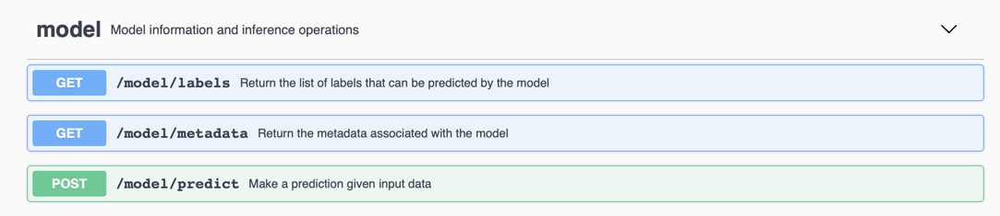

# Deploy a MAX model-serving microservice on IBM Cloud Kubernetes Service

This tutorial describes how to deploy deep learning model-serving microservices from the [Model Asset Exchange](https://developer.ibm.com/exchanges/models/) on [IBM Cloud Kubernetes Service](https://console.bluemix.net/docs/containers/container_index.html#container_index).

> Looking for deployment instructions on other clouds? [This way please](/README.md).

The tutorial assumes some familiarity with Docker, Kubernetes, and the IBM Cloud CLI. 

For illustrative purposes the instructions deploy the [Object Detector Model](https://developer.ibm.com/exchanges/models/all/max-object-detector/). Replace the referenced model name as necessary.

### Prerequisites

1. Install [Docker Desktop](https://www.docker.com/products/docker-desktop).
2. Install the [IBM Cloud CLI](https://console.bluemix.net/docs/cli/index.html#overview).
3. Install the [Kubernetes CLI](https://kubernetes.io/docs/tasks/tools/install-kubectl/).
4. Open a terminal window.Follow the instructions listed below and execute the commands prefixed with `$` in this terminal window.
5. Install the IBM Cloud Container Service plug-in and the Container Registry plug-in. 
   ```
   $ ibmcloud plugin install container-service
    
   $ ibmcloud plugin install container-registry 
   ```

#### Create a Kubernetes cluster

Many MAX model-serving microservices require at a minimim 1 CPU and 2GB of RAM. Use the model documentation to determine a suitable cluster node size.
If you already have access to an appropriately sized cluster skip this section.

1. [Create a free Kubernetes cluster](https://console.bluemix.net/docs/containers/cs_cli_reference.html#cs_cluster_create) with a single (2vCPU, 4GB RAM) node, which is free. In this example the cluster is named `max-cluster`.   

   ```
   $ ibmcloud ks cluster-create --name max-cluster
   ```

   > You can create only 1 freee cluster in your IBM Cloud organization. Free clusters are deleted after 30 days. Some service restrictions apply. 

2. Check the cluster status and wait until deployment has completed.

   ```
   $ ibmcloud ks cluster-ls
   Name          ID            State    Created          Workers   ...   
   max-cluster   ...           normal   8 minutes ago    1         ...
   ```
   
3. [Set the cluster as the context for this session](https://console.bluemix.net/docs/containers/cs_cli_reference.html#cs_cluster_config). 

   ```
   $ ibmcloud ks cluster-config max-cluster
    The configuration for max-cluster was downloaded successfully.
    Export environment variables to start using Kubernetes.
    export KUBECONFIG=/.../kube-config-...-max-cluster.yml

   $ export KUBECONFIG=/.../kube-config-...-max-cluster.yml 
   ```

4. List cluster nodes using [`kubectl get nodes`](https://kubernetes.io/docs/reference/generated/kubectl/kubectl-commands#get) to verify that you can access the cluster using the Kubernetes CLI.
   ```
   $ kubectl get nodes
    NAME                STATUS    ROLES     AGE       VERSION
    ...                 Ready     <none>    14m       v1.10.8+IKS
   ```

### Upload the deep learning model container image to a Container Registry

In IBM Cloud Kubernetes service you can use a public container registry (such as Docker Hub) or a [private container registry](https://console.bluemix.net/docs/services/Registry/registry_overview.html#registry_overview) to store and access container images. If you are planning on deploying a [pre-built container image from Docker Hub](https://hub.docker.com/u/codait/) you can skip this section. To prepare for deployment of a customized container image complete the following tasks.

#### Create a namespace in the Container Registry

1. [Add a namespace](https://console.bluemix.net/docs/services/Registry/registry_cli.html#bx_cr_namespace_add) to create a private repository.

   ```
   $ ibmcloud cr namespace-add max-deployments
    ...

   $ ibmcloud cr namespace-list
    ...
    max-deployments 
   ```

#### Upload image to the Container Registry 

1. Clone the desired MAX model repository and build the Docker image using [`docker build`](https://docs.docker.com/engine/reference/commandline/build/). 

    ```
    $ git clone https://github.com/IBM/MAX-Object-Detector.git
    $ cd MAX-Object-Detector
    $ docker build -t max-object-detector .
    ```
    > To test the image locally run `docker run -it -p 5000:5000 max-object-detector`

2. [`docker tag`](https://docs.docker.com/engine/reference/commandline/tag/) the image using the following scheme: `registry.<region>.bluemix.net/<namespace>/<image>:<tag>`. Replace [`<region>`](https://console.bluemix.net/docs/services/Registry/registry_overview.html#registry_regions), `<namespace>`, `<image>`, and `<tag>` as appropriate. 

   ```
   $ docker tag max-object-detector registry.ng.bluemix.net/max-deployments/max-object-detector

   $ docker images
    REPOSITORY                                                    TAG      ...        
    max-object-detector                                           latest   ...
    registry.ng.bluemix.net/max-deployments/max-object-detector   latest   ...
   ```

2. Push the tagged Docker image to the Container Registry.

   [Log in to the Container Registry](https://console.bluemix.net/docs/services/Registry/registry_cli.html#bx_cr_login), [`docker push`](https://docs.docker.com/engine/reference/commandline/push/) the tagged image to the Container Registry, and [list the registry content](https://console.bluemix.net/docs/services/Registry/registry_cli.html#bx_cr_image_list).
 
   ```
   $ ibmcloud cr login

   $ docker push registry.ng.bluemix.net/max-deployments/max-object-detector
    ...

   $ ibmcloud cr image-list
    Listing images...
    REPOSITORY                                                    TAG     ...   
    registry.ng.bluemix.net/max-deployments/max-object-detector   latest  ...
    ...
   ``` 

You've created a namespace in the IBM Cloud Container Registry and pushed the model-serving Docker image. You can now deploy the model-serving microservice using the image from the Containter Registry and expose it as a service on IBM Kubernetes Service.

#### Deploy the container image and expose it as a service


1. Create a deployment named `max-object-detector` from the container image using [`kubectl run`](https://kubernetes.io/docs/reference/generated/kubectl/kubectl-commands#run). 

   ```
   $ kubectl run max-object-detector --image=registry.ng.bluemix.net/max-deployments/max-object-detector --replicas=1
    deployment.apps "max-object-detector" created
   ```

   > Keep in mind that the cluster's node size effectively limits how many replicas you can run at any point in time.

2. Wait until the desired number of replicas was started. 

   ```
   $ kubectl get pods --watch
    NAME                                READY     STATUS        RESTARTS   AGE
    max-object-detector-...h            1/1       Running       0          4m
   ```

3. Expose the deployment as a public service using [`kubectl expose deployment`](https://kubernetes.io/docs/reference/generated/kubectl/kubectl-commands#expose). Choose a service name, map the container's port (container images are configured to use 5000 by default) to the desired service port (e.g. 80) and select a suitable [service type](https://kubernetes.io/docs/concepts/services-networking/service/#publishing-services-service-types).   

   ```
   $ kubectl expose deployment max-object-detector --port=80 --target-port=5000 --name=max-model-service --type=LoadBalancer --load-balancer-ip=''
    ...
   ```

4. Retrieve the microservice's external IP address using [`kubectl get service`](https://kubernetes.io/docs/reference/generated/kubectl/kubectl-commands#get).

   Service creation can take a couple minutes. Wait until an external IP address is displayed for the `max-model-service`.

   ```
   $ kubectl get service --watch
    NAME                TYPE           CLUSTER-IP     EXTERNAL-IP   PORT(S)        AGE
    kubernetes          ClusterIP      10.0.0.1       <none>        443/TCP        38m
    max-model-service   LoadBalancer   1...5          <pending>     80:30997/TCP   1m
    max-model-service   LoadBalancer   1...5          1...2         80:30997/TCP   1m
   ```

5. Verify that you can access the model-serving microservice using the displayed external IP address (e.g. 1...2) and port number (e.g. 80).

   ```
   $ curl http://1...2:80/model/metadata
    {"id": "ssd_mobilenet_v1_coco_2017_11_17-tf-mobilenet", 
     "name": "ssd_mobilenet_v1_coco_2017_11_17 TensorFlow Model", 
     "description": "ssd_mobilenet_v1_coco_2017_11_17 TensorFlow model trained on MobileNet", 
     "license": "ApacheV2"}
   ```

6. Explore the service endpoints.

   Open `http://1...2:80/` in your favorite web browser to explore the service endpoints using the Swagger specification.

   


   ## References

    - [IBM Cloud Kubernetes Service CLI plug-in](https://console.bluemix.net/docs/containers/cs_cli_reference.html#cs_cli_reference)
    - [IBM Cloud Container Registry CLI plug-in](https://console.bluemix.net/docs/services/Registry/registry_cli.html)
